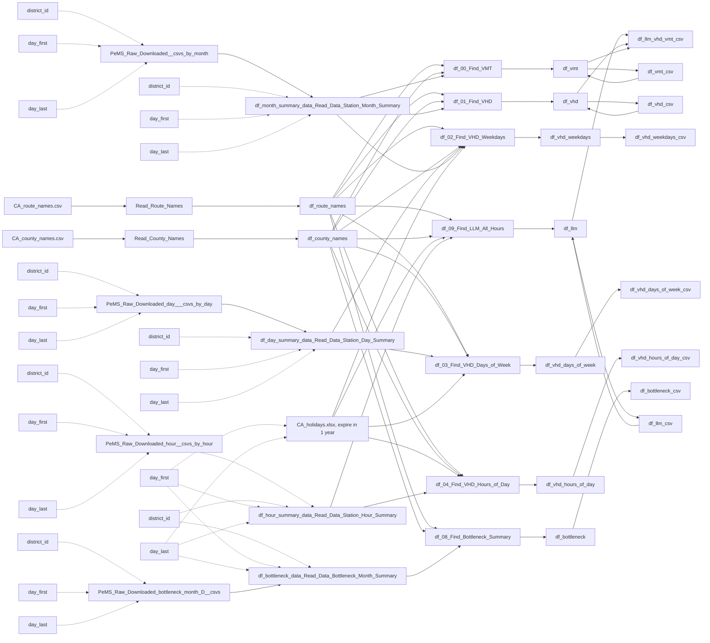

```mermaid
graph LR;
CA_route_names_csv["CA_route_names.csv"] --> Read_Route_Names
CA_county_names_csv["CA_county_names.csv"] --> Read_County_Names
Read_Route_Names --> df_route_names
Read_County_Names --> df_county_names
df_route_names --> df_00_Find_VMT
df_route_names --> df_01_Find_VHD
df_route_names --> df_02_Find_VHD_Weekdays
df_route_names --> df_03_Find_VHD_Days_of_Week
df_route_names --> df_04_Find_VHD_Hours_of_Day
df_route_names --> df_08_Find_Bottleneck_Summary
df_route_names --> df_09_Find_LLM_All_Hours
df_county_names --> df_00_Find_VMT
df_county_names --> df_01_Find_VHD
df_county_names --> df_02_Find_VHD_Weekdays
df_county_names --> df_03_Find_VHD_Days_of_Week
df_county_names --> df_04_Find_VHD_Hours_of_Day
df_county_names --> df_08_Find_Bottleneck_Summary
df_county_names --> df_09_Find_LLM_All_Hours
df_01_Find_VHD --> df_vhd
df_00_Find_VMT --> df_vmt
df_09_Find_LLM_All_Hours --> df_llm
day_first -.-> ca_hols
day_last -.-> ca_hols
PeMS_Raw_Downloaded__csvs_by_month --> df_month_summary_data_Read_Data_Station_Month_Summary
district_id1[district_id] -.-> PeMS_Raw_Downloaded__csvs_by_month
day_first1[day_first] -.-> PeMS_Raw_Downloaded__csvs_by_month
day_last1[day_last] -.-> PeMS_Raw_Downloaded__csvs_by_month
PeMS_Raw_Downloaded_day___csvs_by_day --> df_day_summary_data_Read_Data_Station_Day_Summary
district_id2[district_id]
day_first2[day_first]
day_last2[day_last]
district_id2 -.-> PeMS_Raw_Downloaded_day___csvs_by_day
day_first2 -.-> PeMS_Raw_Downloaded_day___csvs_by_day
day_last2 -.-> PeMS_Raw_Downloaded_day___csvs_by_day
district_id3[district_id]
district_id3 -.-> df_month_summary_data_Read_Data_Station_Month_Summary
day_first3[day_first]
day_first3 -.-> df_month_summary_data_Read_Data_Station_Month_Summary
day_last3[day_last]
day_last3 -.-> df_month_summary_data_Read_Data_Station_Month_Summary
district_id4[district_id]
district_id4 -.-> df_day_summary_data_Read_Data_Station_Day_Summary
day_first4[day_first]
day_first4 -.-> df_day_summary_data_Read_Data_Station_Day_Summary
day_last4[day_last]
day_last4 -.-> df_day_summary_data_Read_Data_Station_Day_Summary
PeMS_Raw_Downloaded_hour__csvs_by_hour -.-> df_hour_summary_data_Read_Data_Station_Hour_Summary
district_id -.-> df_hour_summary_data_Read_Data_Station_Hour_Summary
day_first -.-> df_hour_summary_data_Read_Data_Station_Hour_Summary
day_last -.-> df_hour_summary_data_Read_Data_Station_Hour_Summary
district_id5[district_id]
district_id5 -.-> PeMS_Raw_Downloaded_hour__csvs_by_hour
day_first5[day_first]
day_last5[day_last]
day_first5 -.-> PeMS_Raw_Downloaded_hour__csvs_by_hour
day_last5 -.-> PeMS_Raw_Downloaded_hour__csvs_by_hour
district_id -.-> df_bottleneck_data_Read_Data_Bottleneck_Month_Summary
day_first -.-> df_bottleneck_data_Read_Data_Bottleneck_Month_Summary
day_last -.-> df_bottleneck_data_Read_Data_Bottleneck_Month_Summary
district_id6[district_id]
district_id6 -.-> PeMS_Raw_Downloaded_bottleneck_month_D__csvs
day_first6[day_first]
day_first6 -.-> PeMS_Raw_Downloaded_bottleneck_month_D__csvs
day_last6[day_last]
day_last6 -.-> PeMS_Raw_Downloaded_bottleneck_month_D__csvs
df_day_summary_data_Read_Data_Station_Day_Summary --> df_02_Find_VHD_Weekdays
df_day_summary_data_Read_Data_Station_Day_Summary --> df_03_Find_VHD_Days_of_Week
df_month_summary_data_Read_Data_Station_Month_Summary --> df_00_Find_VMT
df_month_summary_data_Read_Data_Station_Month_Summary --> df_01_Find_VHD
df_month_summary_data_Read_Data_Station_Month_Summary --> df_02_Find_VHD_Weekdays
ca_hols[CA_holidays.xlsx, expire in 1 year]
ca_hols --> df_02_Find_VHD_Weekdays
ca_hols --> df_03_Find_VHD_Days_of_Week
ca_hols --> df_04_Find_VHD_Hours_of_Day
ca_hols --> df_09_Find_LLM_All_Hours
df_hour_summary_data_Read_Data_Station_Hour_Summary --> df_04_Find_VHD_Hours_of_Day
df_hour_summary_data_Read_Data_Station_Hour_Summary --> df_09_Find_LLM_All_Hours
df_02_Find_VHD_Weekdays --> df_vhd_weekdays --> df_vhd_weekdays_csv
df_03_Find_VHD_Days_of_Week --> df_vhd_days_of_week --> df_vhd_days_of_week_csv
df_04_Find_VHD_Hours_of_Day --> df_vhd_hours_of_day --> df_vhd_hours_of_day_csv
df_bottleneck_data_Read_Data_Bottleneck_Month_Summary --> df_08_Find_Bottleneck_Summary --> df_bottleneck --> df_bottleneck_csv
PeMS_Raw_Downloaded_bottleneck_month_D__csvs --> df_bottleneck_data_Read_Data_Bottleneck_Month_Summary
df_llm_csv --> df_llm --> df_llm_vhd_vmt_csv
df_vhd_csv --> df_vhd --> df_llm_vhd_vmt_csv
df_vmt_csv --> df_vmt --> df_llm_vhd_vmt_csv
df_llm_vhd_vmt_csv
df_vhd_csv
df_bottleneck_csv
df_vhd_days_of_week_csv
df_vhd_hours_of_day_csv
df_vhd_weekdays_csv
df_vhd_csv
df_llm --> df_llm_csv
df_vmt --> df_vmt_csv
df_vhd --> df_vhd_csv
df_vmt_csv
df_llm_csv
```
