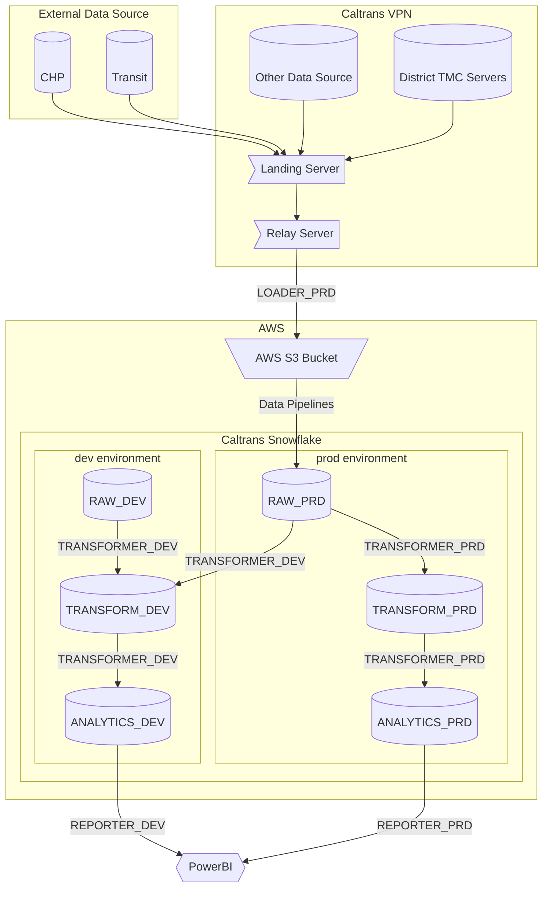
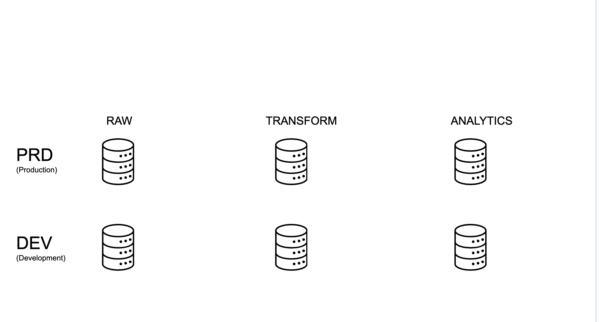
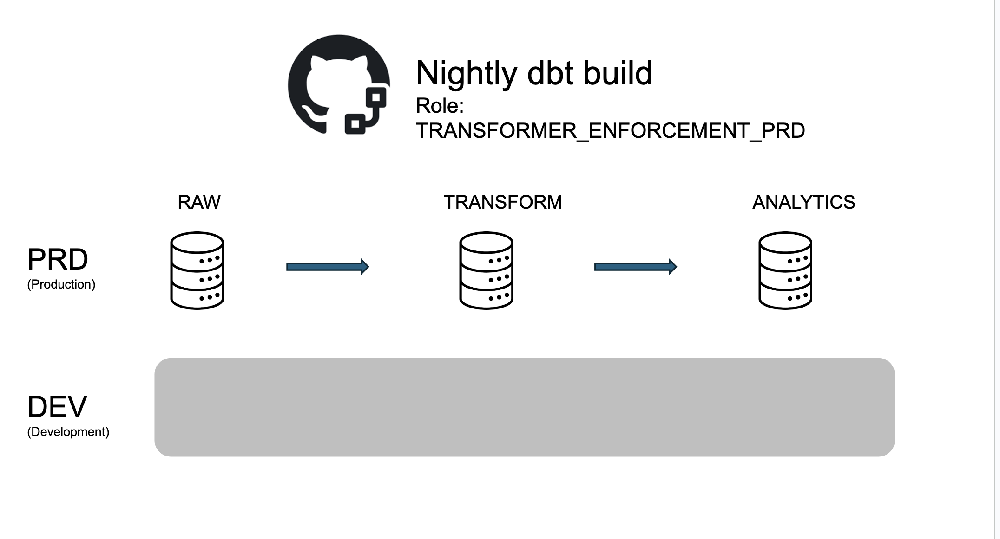
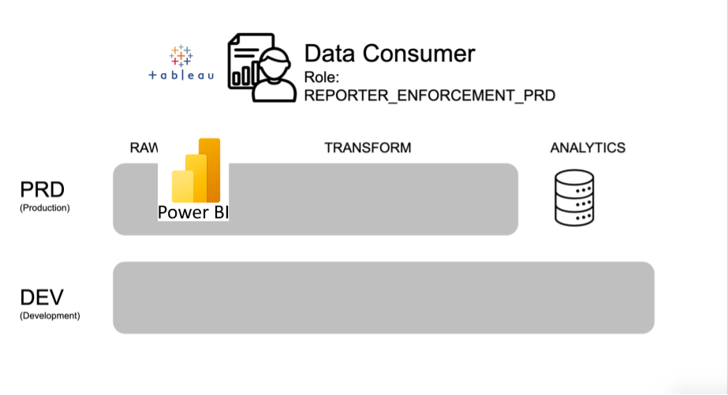

# Project architecture

This project is organized around centralizing data in a Snowflake cloud data warehouse.
Heterogeneous data sources are loaded into raw databases using custom Python scripts.
These datasets are then transformed into analysis-ready marts using [dbt](https://www.getdbt.com/).

We follow an adapted version of the project architecture described in
[this dbt blog post](https://www.getdbt.com/blog/how-we-configure-snowflake/)
for our Snowflake dbt project.

It is described in some detail in ODI CalData's
[Snowflake docs](https://cagov.github.io/data-infrastructure/snowflake/#architecture) as well.



## Snowflake architecture

There are two *environments* set up for this project, development and production.
Resources in the development environment are suffixed with `DEV`,
and resources in the production environment are suffixed with `PRD`.

Most of the time, developers will be working in the development environment.
Once your feature branches are merged to `main`, they will be used in the production environment.

What follows is a brief description of the most important Snowflake resources
in the dev and production environments and how developers are likely to interact with them.

### Six databases

We have six primary databases in our project:

Where our **Source** data lives

- **`RAW_DEV`**: Dev space for loading new source data.
- **`RAW_PRD`**:Landing database for production source data.

Where data from our **Staging and Intermediate** models lives

- **`TRANSFORM_DEV`**: Dev space for staging/intermediate models. This is where most of your dbt work is!
- **`TRANSFORM_PRD`**: Prod space for models. This is what builds in the nightly job.

Where data from our **Marts** models lives

- **`ANALYTICS_DEV`**: Dev space for mart models. Use this when developing a model for a new dashboard or report!
- **`ANALYTICS_PRD`**: Prod space for mart models. Point production dashboards and reports to this database.

### Six warehouse groups

There are six warehouse groups for processing data in the databases,
corresponding to the primary purposes of the above databases.
They are available in a few different sizes, depending upon the needs of the the data processing job,
X-small (denoted by (`XS`), X-Large (denoted by (`XL`), and 4X-Large (denoted by `4XL`).
Most jobs on small data should use the relevant X-small warehouse.

1. **`LOADING_{size}_DEV`**: This warehouse is for loading data to `RAW_DEV`. It is used for testing new data loading scripts.
1. **`TRANSFORMING_{size}_DEV`**: This warehouse is for transforming data in `TRANSFORM_DEV` and `ANALYTICS_DEV`. Most dbt developers will use this warehouse for daily work.
1. **`REPORTING_{size}_DEV`**: This warehouse is for testing dashboards.
1. **`LOADING_{size}_PRD`**: This warehouse is for loading data to `RAW_PRD`. It is used for production data loading scripts.
1. **`TRANSFORMING_{size}_PRD`**: This warehouse is for transforming data in `TRANSFORM_PRD` and `ANALYTICS_PRD`. This warehouse is used for the nightly builds.
1. **`REPORTING_{size}_PRD`**: This warehouse is for production dashboards.

### Six roles

There are six primary functional roles:

1. **`LOADER_DEV`**: Dev role for loading data to the `RAW_DEV` database. This is assumed when developing new data loading scripts.
1. **`LOADER_PRD`**: Prod role for loading data to the `RAW_PRD` database. This is assumed by data loading scripts.

1. **`TRANSFORMER_DEV`**: Dev role for transforming data. This is you! Models built with this role get written to the `TRANSFORM_DEV` or `ANALYTICS_DEV` databases. CI robots also use this role to run checks and tests on PRs *before* they are merged to main.
1. **`TRANSFORMER_PRD`**: Prod role for transforming data. This is assumed by the nightly build job and writes data to the `TRANSFORM_PRD` or `ANALYTICS_PRD` databases.

1. **`REPORTER_DEV`**: Dev role for reading marts. Use this when developing new dashboards. This role can read models in the `ANALYTICS_DEV` database.
1. **`REPORTER_PRD`**: Prod role for reading marts. This is for users and service accounts using production dashboards. This role can read models in the `ANALYTICS_PRD` database.

## Reporting and analysis

The most prominent consumer of the data products from this project are PowerBI and ArcGis dashboards, the PeMS Server, public users (researchers, private sector, and other public agencies).

## Custom schema names

dbt's default method for generating [custom schema names](https://docs.getdbt.com/docs/build/custom-schemas)
works well for a single-database setup:

* It allows development work to occur in a separate schema from production models.
* It allows analytics engineers to develop side-by-side without stepping on each others toes.

A downside of the default is that production models all get a prefix,
which may not be an ideal naming convention for end-users.

Because our architecture separates development and production databases,
and has strict permissions protecting the `RAW_PRD` database,
there is less danger of breaking production models.
So we use our own custom schema name modified from the
[approach of the GitLab Data Team](https://gitlab.com/gitlab-data/analytics/-/blob/master/transform/snowflake-dbt/macros/utils/override/generate_schema_name.sql).

In production, each schema is just the custom schema name without any prefix.
In non-production environments, dbt developers use their own custom schema based on their name: `dbt_username`.

## Developing against production data

Our Snowflake architecture allows for reasonably safe `SELECT`ing
from the production `RAW_PRD` database while developing models.
While this could be expensive for large tables,
it also allows for faster and more reliable model development.

To develop against raw production data, first you need someone with the `USERADMIN` role
to grant rights to the `TRANSFORMER_DEV` role
(this need only be done once, and can be revoked later):

```sql
USE ROLE USERADMIN;
GRANT ROLE RAW_PRD_READ TO ROLE TRANSFORMER_DEV;
```

## Examples

### User personae

To make the preceding more concrete, let's consider the six databases,
`RAW`, `TRANSFORM`, and `ANALYTICS`, for both `DEV` and `PRD`:



If you are a developer, you are doing most of your work in `TRANSFORM_DEV`
and `ANALYTICS_DEV`, assuming the role `TRANSFORMER_DEV`.
*However*, you also have the ability to select the production data from `RAW_PRD` for your development.
So your data access looks like the following:


Now let's consider the nigthly production build. This service account builds the production models
in `TRANSFORM_PRD` and `ANALYTICS_PRD` based on the raw data in `RAW_PRD`.
The development environment effectively doesn't exist to this account, and data access looks like the following:



Finally, let's consider an external consumer of a mart from PowerBI.
This user has no access to any of the raw or intermediate models (which might contain sensitive data!).
To them, the whole rest of the architecture doesn't exist, and they can only see the marts in `ANALYTICS_PRD`:



### Scenario: adding a new data source

1. Write a new Python script (or configure an equivalent loading tool) for loading the data to Snowflake.
1. Assume the `LOADER_DEV` role and load the data into the `RAW_DEV` database.
1. Verify that the data was loaded and looks correct in Snowflake.
1. Schedule the Python script to run using the `LOADER_PRD` role and the `RAW_PRD` database. These data are now ready for dbt modeling.
1. Once the data is loaded to the `RAW_PRD` database, drop the data from the `RAW_DEV` database, it’s not needed anymore.

### Scenario: creating a new dashboard

1. Create a branch and develop your new marts table (or modify an existing one) in `ANALYTICS_DEV` using your normal `TRANSFORMER_DEV` role.
1. Assume the `REPORTER_DEV` role with PowerBI and point it to your mart in `ANALYTICS_DEV`.
1. Once you are happy with your mart and dashboard, merge your branch to main.
1. Once the nightly job is done, your new mart will be built in `ANALYTICS_PRD`.
1. Assume the `REPORTER_PRD` role and point your PowerBI dashboard to the production mart.
