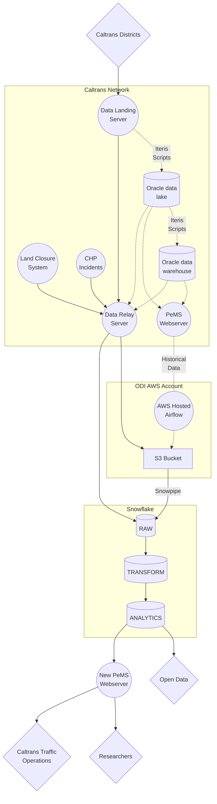

# Data Loading

## Prior state

Raw PeMS data are loaded from a variety of servers in Caltrans' network.
The existing system involves raw data from the various districts
landing on a single server in Caltrans' network.

Historically, this data is then picked up by a series of Perl scripts
which are transformed into a common schema and loaded into an Oracle database,
termed the "data lake".
Further scripts clean and aggregate the data in the data lake,
putting it into another Oracle database termed the "data warehouse".

The raw data and aggregate metrics are served to the public
via the [PeMS Website](https://pems.dot.ca.gov/).

## Data Loading Architecture

We are shifting on-premise data pipelines to the cloud,
and getting data transformation logic into version control.

The above diagram shows the both the prior state and the new architecture,
which are both running until the new state is completed and adopted.
Dotted lines indicate data flow that we hope to deprecate.

!!! note
    This diagram represents our best current understanding of both Caltrans'
    network and our planned final state. There may be errors,
    and not everything is currently implemented.

### Historical Vehicle Detector Station Data

Historical vehicle detector station (VDS) files are accessible via the
[PeMS clearinghouse feeds](https://pems.dot.ca.gov/feeds/clhouse/).
We have an instance of AWS managed Airflow (MWAA) which is loading this data to S3 daily.
These are then picked up by Snowpipe and loaded to Snowflake for further data transformation.

Once we have replaced the ongoing data ingest with the new architecture,
this historical ingest feed based on the clearinghouse can be turned off.

### Ongoing Vehicle Detector Station Data

Raw VDS data from individual districts land on a server within Caltrans as XML files.
We are using a "data relay server" (Apache Airflow running on a virtual machine within Caltrans' network)
to pick up the XML files, transform them to a common schema, aggregate them into daily batches,
and upload them to S3.
These daily batches are then picked up by Snowpipe and loaded into the `RAW` database.

The data relay server may also load some tables from the Oracle data lake and data warehouse systems,
though we intend this to be a temporary pipeline to transfer some auxiliary data,
rather than an ongoing one.

### Lane Closure System (LCS)

TODO

### CHP Incident Data

TODO
