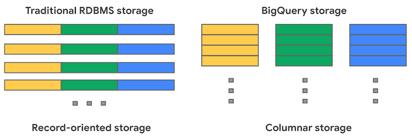
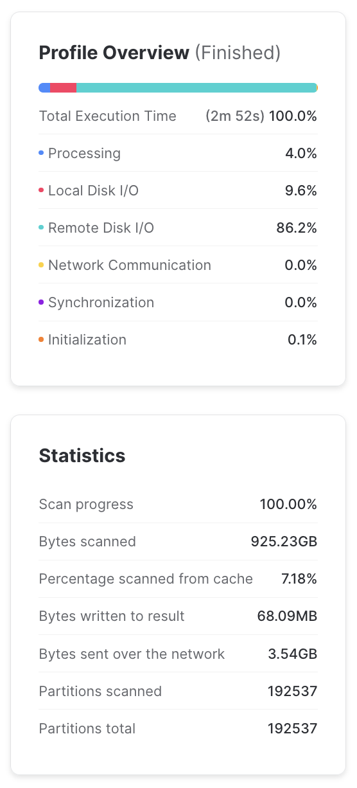
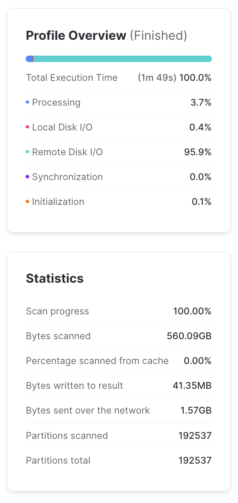
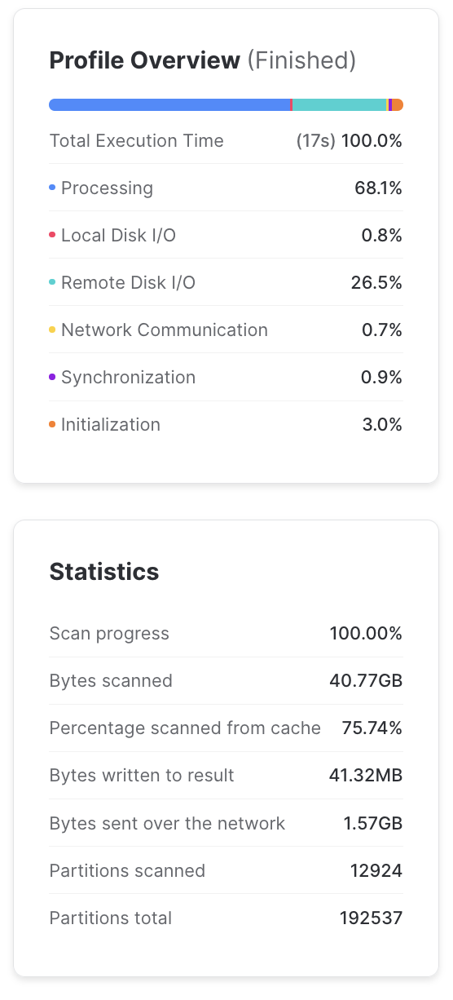

# Cloud Data Warehouses

## What is a cloud data warehouse?

Cloud data warehouses (CDWs) are databases which are hosted in the cloud,
and are typically optimized around analytical queries like aggregations and window functions,
rather than the typical transactional queries that might support a traditional application.
This project uses [Snowflake](https://www.snowflake.com/en/) as its data warehouse.

Cloud data warehouses typically have a few advantages over traditional transactional databases for analytical workflows, including:

* They are usually managed services, meaning you don't have to provision and maintain servers.
* They can scale to truly massive data.

By having a solid understanding of how cloud data warehouses work,
you can construct fast, efficient queries and avoid surprise costs.

### Usage-based pricing
With most on-premise transactional warehouses, costs scale with the number of server instances you buy and run.
These servers usually are always-on and power various applications with high availability.
In a traditional transactional warehouse both compute power and storage are associated with the same logical machine.

Cloud data warehouses typically have a different pricing model:
they decouple storage and compute and charge based on your query usage.
Snowflake charges based on the amount of [compute resources needed to execute your queries](https://www.snowflake.com/pricing/).
Google BigQuery charges based on the amount of [data your queries scan](https://cloud.google.com/bigquery/pricing).
There are also costs associated with data storage, but those are usually small compared to compute.
Though these two models are slightly different, they both lead to a similar take-home lesson:
by being careful with how data are laid out and accessed,
you can significantly reduce both execution time and cost for your cloud data warehouses.

### Data layout

Most cloud data warehouses use columnar storage for their data.
This means that data for each column of a table are stored sequentially in object storage
(this is in contrast to transactional databases which usually store each row, or record, sequentially in storage).
[This BigQuery blog post](https://cloud.google.com/blog/topics/developers-practitioners/bigquery-admin-reference-guide-storage) goes into a bit more detail.



There are a number of consequences of using columnar storage:

* You can read in columns separately from each other.
    So if your query only needs to look at one column of a several-hundred column table,
    it can do that without incurring the cost of loading and processing all of the other columns.
* Because the values in a column are located near each other in device storage,
    it is much faster to read them all at once for analytical queries like aggregations or window functions.
    In row-based storage, there is much more jumping around to different parts of memory.
* Having values of the same data type stored sequentially allows for much more efficient
    serialization and compression of the data at rest.

In addition to columnar storage,
cloud data warehouses also usually divide tables row-wise into chunks called partitions.
Different warehouses choose different sizing strategies for partitions,
but they are typically from a few to a few hundred megabytes.
Having separate logical partitions in a table allows the compute resources to process the partitions independently of each other in parallel.
This massively parallel processing capability is a large part of what makes cloud data warehouses scalable.
When designing your tables, you can often set partitioning strategies or clustering keys for the table.
This tells the cloud data warehouse to store rows with similar values for those keys within the same partitions.
A well-partitioned table can enable queries to only read from the partitions that it needs, and ignore the rest.

### Constructing queries for cloud data warehouses

With the above understanding of how cloud data warehouses store and process data,
we can write down a set of recommendations for how to construct efficient queries for large tables stored within them:

* *Only `SELECT` the columns you need.*
    Columnar storage allows you to ignore the columns you don't need,
    and avoid the cost of reading it in. `SELECT *` can get expensive!
* *If the table has a natural ordering, consider setting a partitioning or clustering key.*
    For example, if the data in the table consists of events with an associated timestamp,
    you might want to cluster according to that timestamp.
    Then events with similar times would be stored near each other in the same or adjacent partitions,
    and queries selecting for a particular date range would have to scan fewer partitions.
* *If the table has a partitioning or clustering key already set, try to filter based on that in your queries.*
    This can greatly reduce the amount of data you need to scan. The queries based on these filters
    should be as simple as you can manage, complex predicates on clustered columns can make it
    difficult for query optimizers to prune partitions.
* *Filter early in complex queries, rather than at the end.*
   If you have complex, multi-stage queries, filtering down to the subset of interest at the outset
   can avoid the need to process unnecessary data and then throw it away later in the query.

!!! note
    For people coming from transactional databases,
    the considerations about partitioning and clustering may seem reminiscent of indexes.
    Cloud data warehouses usually don't have traditional indexes,
    but partitioning and clustering keys fill approximately the same role,
    tailored to the distributed compute model.


### Primary keys and constraints

A central feature of cloud data warehouses is that storage is separate from compute,
and data can be processed in parallel by distributed compute resources while they cost money.
The less communication that needs to happen between these distributed compute resources,
the faster they can work.
For this reason, most cloud data warehouses do not support primary keys,
foreign keys, or other constraints.

For example: if we have a foreign key constraint set on a table and insert a new record,
we would have to scan every single row of the parent table to see if the referenced row exists and is unique.
If the table is large and partitioned, this could mean spinning up a large amount of compute resources,
just to insert a single row.
So rather than supporting constraints with horrible performance characteristics,
cloud data warehouses just don't do it.
This can be surprising to some people, since they often still include the syntax for constraints for SQL standard compatibility
(see the Snowflake docs on [constraints](https://docs.snowflake.com/en/sql-reference/constraints-overview)).

!!! note
    One exception to the above is `NOT NULL` constraints,
    which can be done cheaply since they don't require information from other tables or partitions to be enforced.

## Interactive Exercise

This exercise is intended to be done live with collaborators.
It should read fine, but will be more impactful if we set up a lab setting!

We'll be querying PeMS vehicle detectory station data stored in Snowflake.
The dataset in question consists of (at the time of this writing)
20+ years of detector data at thirty second resolution.
It has a quarter of a trillion events and takes over 2 terabytes of storage.

Because it is event data with a timestamp, we have set a clustering key for the event date,
so that all events with the same date are in the same (or adjacent) partitions.

All queries for this exercise were run on an XL Snowflake warehouse.

#### Initial query

Suppose we want to know how many vehicles are counted in the first lane of each station for each calendar date in 2023.
An initial query might look something like this:

```sql
SELECT
    ID,
    SAMPLE_DATE,
    SUM(FLOW_1) AS FLOW_1,
    SUM(FLOW_2) AS FLOW_2,
    SUM(FLOW_3) AS FLOW_3,
    SUM(FLOW_4) AS FLOW_4,
    SUM(FLOW_5) AS FLOW_5,
    SUM(FLOW_6) AS FLOW_6,
    SUM(FLOW_7) AS FLOW_7,
    SUM(FLOW_8) AS FLOW_8
FROM RAW_PRD.CLEARINGHOUSE.STATION_RAW
WHERE SAMPLE_DATE > date_from_parts(2023, 1, 1)
AND SAMPLE_DATE < date_from_parts(2024, 1, 1)
GROUP BY ID, SAMPLE_DATE
```

This query took about three minutes to run. Not too bad!
But when we look at some statistics from the query profile, we start to see some problems:



Yikes! We can see from the "Bytes scanned" that this query scanned almost a terabyte of data,
or about half of the overall dataset.
Ideally, we should not scan the entire dataset to get some relatively simple statistics for a single year.
We can also see that from the "Profile Overview", remote disk I/O takes about 86% of the processing time,
so anything we can do to cut down on disk I/O will likely be worthwhile.

Based on an XL warehouse's burn rate of about $1 per minute, this query costs about $3.
If we were running this many times a day, it could easily cost thousands of dollars per year.

#### Take advantage of column pruning

Let's see what we can do to cut down on the amount of data that is read by our query.
Note that we are doing an aggregation on all eight lanes of traffic in the dataset,
but our initial question only asked about the first lane of traffic.
We are computing (and thus reading) more data than we actually need for the problem!
Because data are stored in a columnar layout, it's easy to reduce the data scanned
by just not selecting the columns we don't need.

Let's just select the flow for the first lane:

```sql
SELECT
    ID,
    SAMPLE_DATE,
    SUM(FLOW_1) AS FLOW
FROM RAW_PRD.CLEARINGHOUSE.STATION_RAW
WHERE SAMPLE_DATE > date_from_parts(2023, 1, 1)
AND SAMPLE_DATE < date_from_parts(2024, 1, 1)
GROUP BY ID, SAMPLE_DATE
```

This ran in under two minutes, and by inspecting the query profile, it's clear why:
this query scanned a little over half the amount of data as the first one.
By selecting the only the columns we wanted, we avoided loading a lot of unnecessary data!



Using `SELECT *` is often a bad idea in any database,
but it can have particularly bad performance consequences for columnar data warehouses.

#### Take advantage of partition pruning

There is another problem with the performance of the above queries.
You can see that there are about two hundred thousand partitions in the entire dataset ("Partitions total").
And the number of partitions that the queries scanned ("Partitions scanned") was the same!
That is to say, we needed to read through every single partition,
even though we were only interested in the partitions corresponding to 2023.

Because we set a clustering key for the `SAMPLE_DATE`, we should be able to efficiently select
records for specific date ranges.
However, query optimizers are not always as good at reasoning about partitions as we would like them to be.
In this case, Snowflake is unable to reason about the result of the `date_from_parts()` function well enough
to know what its result will be (even though it will result in a constant date!).

Since Snowflake cannot figure out the result of the `date_from_parts()` call,
it gives up and scans every partition to figure out if its date is satisfied by the filtering predicates.
If, however, we write a hard-coded date string, Snowflake's query optimizer *is* able to figure out
which partitions it needs to read. So the following query, which is logically equivalent,
has *much* better performance characteristics

```sql
SELECT
    ID,
    SAMPLE_DATE,
    SUM(FLOW_1) AS FLOW
FROM RAW_PRD.CLEARINGHOUSE.STATION_RAW
WHERE SAMPLE_DATE > '2023-01-01'
AND SAMPLE_DATE < '2024-01-01'
GROUP BY ID, SAMPLE_DATE
```

This runs in about seventeen seconds, and only scans a small fraction of the partitions in the dataset:



You'll also note that the total processing time is much more weighted towards actual data processing
rather than I/O.
This is a good thing: we want our compute processes to be working hard for us,
rather than waiting idly for data to traverse the network while they cost money.

The moral here is: partition pruning can drastically reduce the amount of data you need to process,
but you sometimes need to be careful about query construction to have it behave properly.
Pay attention to the results of the query profile if your queries are not having the performance you expect!

#### Summary

By using our knowledge about how cloud data warehouses work and how their data are laid out,
we were able to take a query that took several minutes and cost a few dollars
to one that took a fraction of the time and cost a few cents.

It's a good idea to keep an eye on the query profiler to make sure your queries are performing as expected
(especially for ones that are run frequently, or touch a lot of data).

## References
* [Snowflake documentation on clustering and micropartitions](https://docs.snowflake.com/en/user-guide/tables-clustering-micropartitions)
* [Snowflake documentation on query performance profiling](https://docs.snowflake.com/user-guide/ui-query-profile)
* [Blog post on BigQuery's strategy for data layout and storage](https://cloud.google.com/blog/topics/developers-practitioners/bigquery-explained-storage-overview)
* [BigQuery partitioning guide](https://cloud.google.com/bigquery/docs/partitioned-tables)
* [BigQuery optimization guide (most tips apply more generally to CDWs)](https://cloud.google.com/bigquery/docs/best-practices-performance-overview)
