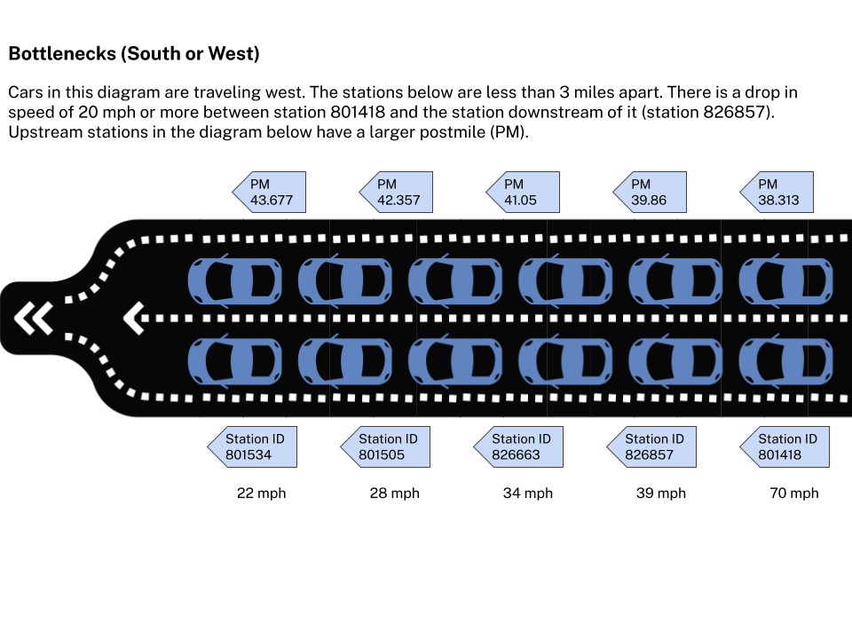

# Bottlenecks

The PeMS system runs a bottleneck identification algorithm every day. The original algorithm was presented in, "[Systematic Identification of Freeway Bottlenecks](../files/Systematic_Identification_of_Freeway_Bottlenecks.1.pdf)," by Chen, C., Skabardonis, A., Varaiya, P. (2003). Transportation Research Board, 2004.

This model identifies bottlenecks at every station. A bottleneck is defined by the following conditions:

1. There is a drop in speed of at least 20 mph between stations during the same time
2. The speed at the current station (downstream station) is less than 40 mph.
3. The stations are less than 3 miles apart.
4. The speed drop persists for at least 5 out of any 7 contiguous 5-minute data points.

If all of these conditions are met then we declare that there is a bottleneck at this location that has been activated for all of the seven 5-minute time points. We perform this analysis for each of three time periods:

- AM shift (5am - 10am)
- Noon shift (10am - 3pm)
- PM shift (3pm - 8pm)

For each location where a bottleneck is activated we compute the following:

1. **Duration** - This is how long the bottleneck was active during that particular shift on that day.
2. **Spatial Extent** - For each 5-minute period when the bottleneck was active we see how far upstream the bottleneck extends. For this, at each time point, we find the farthest upstream detector with speed less than 40 mph and use that location as the extent during that 5-minute period. To get a single extent for the entire bottleneck, we take the median of the extents for each 5-minute period.
3. **Delay** - The delay is simply the sum of the individual PeMS segment delays for the entire duration and spatial extent of the bottleneck. The delay is calculated with respect to a threshold speed of 60 mph.

Here we can see a [GIS representation of bottleneck](https://gisdata-caltrans.opendata.arcgis.com/maps/9509bf8a475f49b4a9c79bac15f8b479) and
[read additional details](https://dot.ca.gov/programs/traffic-operations/mpr/bottleneck) of what this map represents.

## Bottleneck direction considerations

**North/East**
Absolute postmile increases going north and east. This means when the direction of the freeway for a station is north or east, the **"upstream" station has a smaller postmile**, and we need to *lag* our calculations.

**South or West**
Absolute postmile decreases going south and west. This means when the direction of the freeway for a station is south or west, the **"upstream" station has a larger postmile**, and we need to *lead* our calculations.

Bottlenecks are analyzed across all lanes so any variables we use in developing bottleneck-related calculations should also be across all lanes at a given station. This also means we do not partition the data by lane.

Additional information about bottlenecks from FHWA can be found at the following links. These details do not impact current bottleneck analysis but can be useful in future discussions: https://ops.fhwa.dot.gov/bn/lbr.htm and https://ops.fhwa.dot.gov/bn/bnchart.htm

Below we can see an example of five instances (highlighted in green) of when the four conditions mentioned above are met out of a rolling window of 7.

## Our current implementation of Bottlenecks versus Systematic Identification of Freeway Bottlenecks

The diagram below illustrates the logic in the "Systematic Identification of Freeway Bottlenecks" paper linked to above and also states how our implementation is a reversal. We are currently in agreement that while our implementation is different, it is also easier to understand. To match our logic with what is in the paper we'd simply have to do sign reversal in various places in our model.

