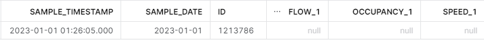
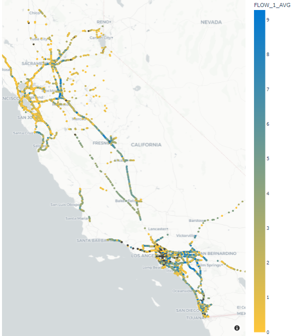
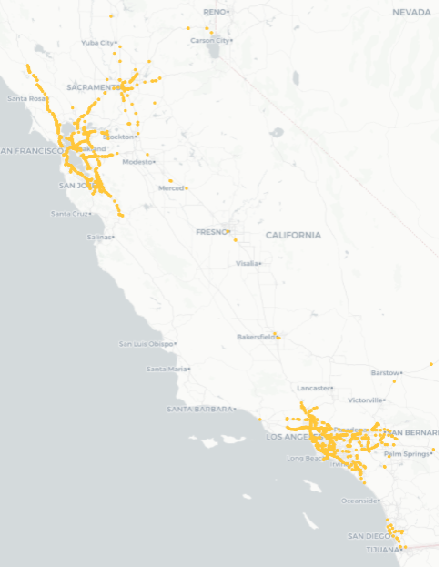

# Caltrans PeMS: Exploratory Data Analysis

## Background

The California Department of Transportation (Caltrans) collects data that describes the flow of traffic on California freeways. Caltrans stores these data in a database called PeMS. The data describe the number of counts per unit time measured by roughly 45,000 sensors on a 30-second cadence. The type of sensor varies considerably, e.g. radar and magnetometers (see Chapter 1 of the [Introduction to PeMS User Guide](https://pems.dot.ca.gov/Papers/PeMS_Intro_User_Guide_v6.pdf)).

In some cases, these data are missing. Faulty or broken sensors do not collect data. Or sensor data is not wirelessly transmitted back to PeMS. In addition, Caltrans performs some calculations to convert these raw sensor data into physical observables such as speed. These calculations include some assumptions such as the length of the vehicle, or *g*. Based on the quality of the assumption, these data can include errors.

## Goals
The goals for the project were two-fold: to learn how to use Snowflake to analyze large datasets and to answer a few basic questions about the nature of the data. We developed an interactive data visualization to quickly explore the data.

## Findings

We report three main findings about the nature of the data.

1. Do some types of roads have more missing data than others? The Caltrans/PeMS sensor data describes many different types of roads. Some are interstate roads, while others are small, local roads. The California Department of Transportation identifies [seven major types of roads](https://dot.ca.gov/programs/research-innovation-system-information/office-of-highway-system-information-performance/functional-classification). The data we have does not specify the type of road. There is a ‘FWY’ column for each station that contains an integer road number. The 15, 10, and 5 freeways have the most sensors.
2. Do some regions have more missing data than others? The Caltrans/PeMS data is organized by districts. This map shows how Caltrans carves the state into 11 districts. An analysis of data in 2022 and 2023 shows 19.2 thousand sensors with almost 28 billion observations. Some 5.6% of the sensors had all null observations (`FLOW_1`) and 9.1% of the sensors had all zero observations (`FLOW_1`) . We observed a few different types of missing data: single missing observations, intermittent outages for a few minutes during the day, and hours to months long outages.
3. Do the calculations for speed and traffic flow make sense? The Caltrans/PeMS data uses some heuristics to calculate speed and traffic flow. Are these reasonable? To answer this question, we can try to confirm some basic traffic patterns. For example: Does traffic increase during [peak traffic hours](https://dot.ca.gov/programs/traffic-operations/hov), which is 6am to 10am and again from 3pm to 7pm in Northern California? While there are some anomalous observations, the flow and speed generally follow a pattern with low speeds and high flow during peak traffic hours. See Figure 6 for an example.

Figure 1. An example of a null observation.

Figure 2. An example of an observation containing all zero values.

Figure 3. Average lane 1 flow from all California sensors in 2022 and 2023. Black dots represent sensors with all null values.

Figure 4. Sensors reporting all null values for 2022 and 2023.

Figure 5. Sensors reporting all zero values for 2022 and 2023. These appear to be centered around the major metropolitan areas.

Figure 6. The speed (left) and flow (right) of traffic over the Bay Bridge on Tuesday, September 13, 2022.

## Deliverables

* Deliverable 1: We learned how to use Snowflake to analyze large datasets. To read data from Snowflake, we used an open-source Python package called Ibis. Ibis provides a Python interface to Snowflake that's easy to use. [Ibis](https://ibis-project.org/) loads data from a Snowflake into a pandas dataframe. pandas dataframes connect nicely to a typical data science workflow. We demonstrated this workflow in [this notebook](https://github.com/cagov/caldata-mdsa-caltrans-pems/blob/main/pems/missing_data.ipynb), located in the `/pems` subdirectory.

* Deliverable 2: This documentation.

* Deliverable 3: An interactive data visualization. We ultimately chose to go with building the dashboard via [Dash](https://dash.plotly.com). This was mainly due to the platform's maturity, robust documentation, and known flexibility (see Table 1). While Dash provided a working solution that was performant enough to work with, the poor deployment options are a disappointment. To make deployment of these Dash apps workable, it would require the team to adopt this as a standard. This is because it requires standing up a server, or paying plotly to host it. Streamlit appears to check most of the boxes; however, its scalability and performance is the only open question. Shiny for Python appears to be very promising; however, it is still relatively new.

| Tool | Pros | Cons | Deployment options |
| ---- | ---- | ---- | ------------------ |
[Dash Plotly](https://dash.plotly.com/) |  <ul><li> Well established with good documentation and community</li><li>Simple interactive plots via plotly<li>Flexible</li></ul> | <ul><li>No simple hosting option</li></ul> | <ul><li>Self hosted options</li><li>Paid options</li><li>[Deploy Your Dash App \| Dash for Python Documentation \| Plotly](https://dash.plotly.com/deployment)</li></ul> |
[Streamlit](https://streamlit.io/) | <ul><li>Probably simplest to get started and easiest to deploy</li><li>Integrates with Snowflake</li><li>Free and simple deployment options</li><li>Robust community | <ul><li>Limited functionality and scalability compared to others</li><li>Limited in ability to take input from user interaction (e.g. clicks) with maps/visualizations</li></ul> | <ul><li> [Streamlit in Snowflake](https://www.snowflake.com/en/data-cloud/overview/streamlit-in-snowflake/)</li><li>[Easy and free via Github](https://streamlit.io/cloud)</li><ul><li>No paid options for more compute and memory</ul></li> |
[Shiny for Python](https://shiny.posit.co/py/) | <ul><li>The R implementation is one of the most well established and mature dashboarding ecosystems for any language</li><li>Free and simple deployment options | <ul><li>Relatively new for Python so documentation and community is currently limited | <ul><li>Self hosted options via shiny server</li><li>[Deployment Options](https://shiny.posit.co/py/docs/deploy.html)</li><li>Easy and free via [shinyapps.io](https://www.shinyapps.io/)</li><ul><li>Paid options for more compute and memory    |

Table 1. Comparison of different dashboard options

## Remaining Questions
Here are some open questions we recommend probing.

* Why would sensors not report for long periods of time? Why do some sensors have zero values for a long period of time while others report null values?
* What are the different reasons why a sensor’s data may be missing? Does this differ by sensor type, location, lane, etc.? Which type of missing data requires imputation?
* Do some years or seasons have more missing data than others?
* How many total sensors are there? (There is a discrepancy between the website reporting 40K sensors and the data containing 25K sensors).
* Does the data we have include imputed data? If so, is there a way to tell what is imputed or not?
* What is reasonable in terms of a sensor missing data?
* What source of data are we using?