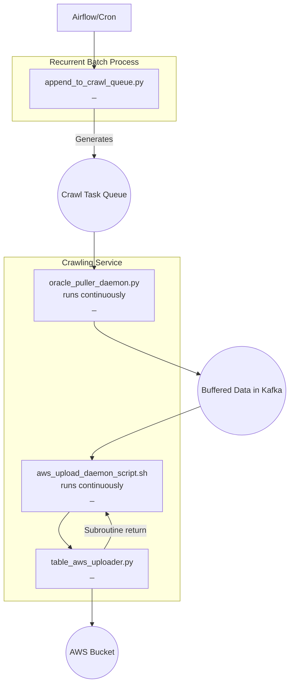

## Big picture of data relay
The data relay process employs a task queue model, wherein a specific crawl task 
is outlined as an entry in the task queue. This model enables the system to continuously 
poll for new tasks, executing each crawl task as it appears. Intermediate data from the 
crawl tasks is saved into the Kafka. Another function, known as the topic_uploader, polls 
the Kafka for this intermediate data, uploading it to AWS.


The adoption of Kafka offers numerous advantages. Primarily, it improves latency as the 
crawling service operates on a continual basis rather than at scheduled intervals. 
It also promotes robustness, allowing the system to restart and resume from the previous 
point in case of any disruptions. Additionally, Kafka eases the process of extending 
new functionality, meaning the incorporation of new data sources does not disrupt 
the existing processes.




## How to create a systemd service for python script oracle_puller_daemon.py
1. Create a new service file in /etc/systemd/system with a .service extension. For example, lets call it oracle_puller.service:
First go to `jupyter@svgcmdl01` and
```bash
sudo vi /etc/systemd/system/oracle_puller.service
```
2. Populate the file with the following lines:
Create a file `/etc/systemd/system/oracle_puller.service.sh`
```bash
#!/usr/bin/bash
source /home/jupyter/.bashrc
cd /data/projects/crawler
python3 oracle_puller_daemon.py
```
Make necessary `chmod` `chown` etc. 

Then, edit `/etc/systemd/system/oracle_puller.service`
```bash
[Unit]
Description=Oracle Puller Daemon
After=network.target
[Service]
ExecStart=/etc/systemd/system/oracle_puller.service.sh
WorkingDirectory=/data/projects/crawler
Restart=always
User=<your-user> # Change <your-user> with your username.
[Install]
WantedBy=multi-user.target
```
This configuration tells systemd to always restart the service after it exits, 
regardless of whether it was clean or unclean, success or not. 
`After=network.target` ensures that your service will start after the 
network has been set up.
Make necessary `chmod` `chown` etc. 

4. Enable the service so that it starts automatically at boot:
```bash
sudo systemctl enable oracle_puller.service
```
5. You can manually start the service now with:
```bash
sudo systemctl start oracle_puller.service
```
6. You can check the status of your service with:
```bash
sudo systemctl status oracle_puller.service
```
For this configuration, the python script should not daemonize itself. Systemd will take care of running it in the background. It should just do its work and exit when done.


