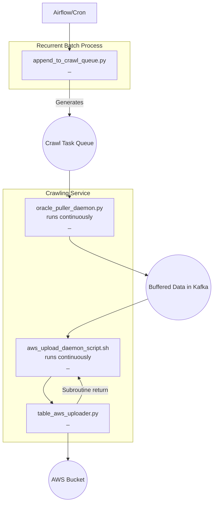

## Big picture of data relay
The data relay process employs a task queue model, wherein a specific crawl task 
is outlined as an entry in the task queue. This model enables the system to continuously 
poll for new tasks, executing each crawl task as it appears. Intermediate data from the 
crawl tasks is saved into the Kafka. Another function, known as the topic_uploader, polls 
the Kafka for this intermediate data, uploading it to AWS.

The adoption of Kafka offers numerous advantages. Primarily, it improves latency as the 
crawling service operates on a continual basis rather than at scheduled intervals. 
It also promotes robustness, allowing the system to restart and resume from the previous 
point in case of any disruptions. Additionally, Kafka eases the process of extending 
new functionality, meaning the incorporation of new data sources does not disrupt 
the existing processes.

